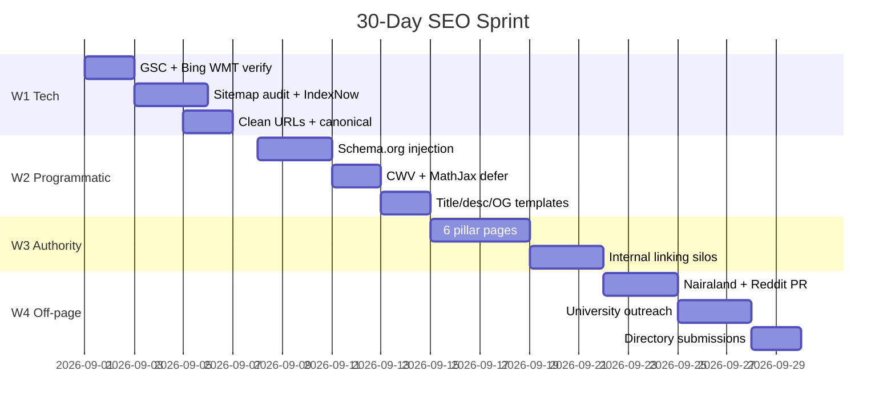

# My Exam Companion: Top-of-Google & Bing Playbook

> **Project:** My Exam Companion (`https://myexamcompanion.pages.dev`)
> **Stack:** Cloudflare Pages (frontend) · Cloudflare R2 (question JSON) · Supabase (auth/profile) · MongoDB API on Oracle VM
> **Niche:** Multi-country EdTech (JAMB, WAEC, NECO, WASSCE, SAT, Post-UTME)
> **Companion doc:** [`rank_high_on_seo.md`](./rank_high_on_seo.md) — long-form technical audit. This file is the **action checklist** + **ready-to-paste snippets**.

---

## 0. How to use this doc
1. Work top to bottom. Each phase lists the **files to edit** and the **code to paste**.
2. Don't move to Phase *n+1* until the previous phase's checklist is fully ticked.
3. Re-run Lighthouse + Rich Results Test after every phase.

---

## Phase 1 — Technical foundation (Week 1)

### 1.1 Verify the site
- [ ] **Google Search Console** — add property, verify via Cloudflare DNS TXT.
- [ ] **Bing Webmaster Tools** — add site, verify, import GSC sitemap.
- [ ] **Cloudflare Web Analytics** — turn on (cookieless, zero CWV impact).

### 1.2 Sitemaps
- [ ] Confirm `generate-sitemap.cjs` writes:
  - `sitemap.xml` (index)
  - `sitemap-ng.xml`, `sitemap-gh.xml`, `sitemap-us.xml`
  - `sitemap-static.xml`
- [ ] Each URL in the sitemap must have a unique `<lastmod>` (ISO-8601 UTC).

### 1.3 Clean semantic URLs
Replace `public/_redirects` with:

```text
# R2 proxy (keep)
                                       /r2/* https://pub-d048d28d4cd54d579def4bf758d5a298.r2.dev/:splat 200

# Root
/                                       /modules/ 302

# Clean programmatic SEO routes
/exams/:country/:exam/:subject/:year    /modules/study/classroom/classroom_questions.html?exam_id=:country/:exam&subject=:subject&year=:year  200
/exams/:country/:exam/:subject          /modules/study/classroom/classroom_questions.html?exam_id=:country/:exam&subject=:subject  200
/exams/:country/:exam                   /modules/study/classroom/classroom_questions.html?exam_id=:country/:exam  200
/syllabus/:country/:exam/:subject       /modules/study/syllabus/syllabus_view.html?exam_id=:country/:exam&subject=:subject  200
/brochure/:country/:exam                /modules/study/brochure/brochure.html?exam_id=:country/:exam  200
```

### 1.4 Robots policy
Replace `public/robots.txt` with:

```text
User-agent: *
Allow: /
Disallow: /admin_panel/
Disallow: /auth/
Disallow: /earnings/
Disallow: /task/
Disallow: /editor_program/
Disallow: /publisher_program/
Disallow: /api/

Sitemap: https://myexamcompanion.pages.dev/sitemap.xml
Sitemap: https://myexamcompanion.pages.dev/sitemap-static.xml
Sitemap: https://myexamcompanion.pages.dev/sitemap-ng.xml
Sitemap: https://myexamcompanion.pages.dev/sitemap-gh.xml
Sitemap: https://myexamcompanion.pages.dev/sitemap-us.xml
Sitemap: https://myexamcompanion.pages.dev/sitemap-brochure-ng.xml
```

### 1.5 IndexNow (instant Bing + Yahoo + DuckDuckGo indexing)
Drop these two static files at site root:
- `public/BingSiteAuth.xml` → `<users><user>YOUR_INDEXNOW_KEY</user></users>`
- `public/INDEXNOW_KEY.txt` → contains the same key (used by `generate-sitemap.cjs`)

Then append to `generate-sitemap.cjs` after each successful sitemap write:

```js
// snippet to append inside generate-sitemap.cjs
const KEY = require('fs').readFileSync('./public/INDEXNOW_KEY.txt', 'utf8').trim();
const HOST = 'myexamcompanion.pages.dev';

async function indexNow(urls) {
  if (!urls.length) return;
  await fetch('https://api.indexnow.org/indexnow', {
    method: 'POST',
    headers: { 'Content-Type': 'application/json; charset=utf-8' },
    body: JSON.stringify({ host: HOST, key: KEY, keyLocation: `https://${HOST}/INDEXNOW_KEY.txt`, urlList: urls })
  });
}
```

Call `indexNow(newUrls)` right after writing each partitioned sitemap.

---

## Phase 2 — Per-page meta scaffold (Week 1–2)

In every classroom / syllabus / brochure page, inject the dynamic meta block (place at the top of `<head>`). Pseudo-code so it works for any {country, exam, subject, year}:

```html
<title>{{exam}} {{subject}} {{year}} Past Questions & Answers (Free CBT) | My Exam Companion</title>
<meta name="description" content="Practice {{exam}} {{subject}} {{year}} past questions online for free. Includes official answer keys, step-by-step explanations, CBT timer, and instant score report.">
<link rel="canonical" href="https://myexamcompanion.pages.dev/exams/{{country}}/{{exam}}/{{subject}}/{{year}}">
<meta property="og:title" content="{{exam}} {{subject}} {{year}} Past Questions (Free CBT)">
<meta property="og:description" content="Free {{exam}} {{subject}} {{year}} CBT practice with answers and timer.">
<meta property="og:type" content="website">
<meta property="og:url" content="https://myexamcompanion.pages.dev/exams/{{country}}/{{exam}}/{{subject}}/{{year}}">
<meta property="og:image" content="https://myexamcompanion.pages.dev/og/exam-{{country}}-{{exam}}-{{subject}}.png">
<meta name="twitter:card" content="summary_large_image">

<noscript>
  <h1>{{exam}} {{subject}} Past Questions — {{year}} CBT Practice</h1>
  <p>Practice free {{exam}} {{subject}} {{year}} past questions with answers on My Exam Companion. Includes CBT timer, instant scoring, and detailed explanations.</p>
</noscript>
```

Title / H1 / description formulas:
- **Title:** `<Exam> <Subject> <Year> Past Questions & Answers (Free CBT) | My Exam Companion`
- **Meta description:** `Practice <Exam> <Subject> <Year> past questions online for free. Includes official answer keys, step-by-step explanations, CBT timer, and score calculator.`
- **H1:** `<Exam> <Subject> Past Questions — <Year> CBT Practice`

---

## Phase 3 — Structured data (Week 2)

In every classroom page, paste this inside `<head>` (replace placeholders server-side from the page's question set; if rendering is CSR, render a static shell for the *first* 5 questions per page to guarantee crawler pickup):

```html
<script type="application/ld+json">
{
  "@context": "https://schema.org",
  "@type": "Quiz",
  "name": "{{exam}} {{subject}} {{year}} Past Questions CBT Practice",
  "description": "Free online CBT practice for {{exam}} {{subject}} {{year}} with detailed answers.",
  "educationalLevel": "Secondary Education",
  "about": { "@type": "Thing", "name": "{{subject}}" },
  "hasPart": [
    {
      "@type": "Question",
      "name": "{{q.text}}",
      "text": "{{q.text}}",
      "acceptedAnswer": { "@type": "Answer", "text": "Correct Answer: Option {{q.answerLetter}}. {{q.explanation}}" }
    }
  ]
}
</script>

<script type="application/ld+json">
{
  "@context": "https://schema.org",
  "@type": "BreadcrumbList",
  "itemListElement": [
    { "@type": "ListItem", "position": 1, "name": "Home", "item": "https://myexamcompanion.pages.dev/" },
    { "@type": "ListItem", "position": 2, "name": "{{country}}", "item": "https://myexamcompanion.pages.dev/exams/{{country}}" },
    { "@type": "ListItem", "position": 3, "name": "{{exam}}", "item": "https://myexamcompanion.pages.dev/exams/{{country}}/{{exam}}" },
    { "@type": "ListItem", "position": 4, "name": "{{subject}}", "item": "https://myexamcompanion.pages.dev/exams/{{country}}/{{exam}}/{{subject}}" },
    { "@type": "ListItem", "position": 5, "name": "{{year}}", "item": "https://myexamcompanion.pages.dev/exams/{{country}}/{{exam}}/{{subject}}/{{year}}" }
  ]
}
</script>
```

Validate with Google's **Rich Results Test** on at least 3 sample URLs per country.

---

## Phase 4 — Core Web Vitals (Week 2)

1. **Defer non-critical scripts** in `classroom_questions.html` and friends:
   ```html
   <script defer src="https://cdn.jsdelivr.net/npm/@supabase/supabase-js@2"></script>
   <link rel="preload" href="https://cdnjs.cloudflare.com/ajax/libs/font-awesome/6.5.1/css/all.min.css" as="style" onload="this.onload=null;this.rel='stylesheet'">
   ```
2. **Conditional MathJax** — only load when a `$` or `\[` is detected:
   ```html
   <script>
     (function(){
       var needsMath = /(\$|\\\(|\\\[|\\begin\{)/.test(document.body.innerHTML);
       if (needsMath) {
         var s = document.createElement('script');
         s.defer = true;
         s.src = 'https://cdn.jsdelivr.net/npm/mathjax@3/es5/tex-mml-chtml.js';
         document.head.appendChild(s);
       }
     })();
   </script>
   ```
3. **Fonts** — always `&display=swap`; preload Inter weights 400/700.
4. **Images** — every diagram in R2 must be **WebP/AVIF ≤ 80 KB** with explicit `width`/`height`.
5. **Lighthouse target:** Performance ≥ 90, SEO 100, Best Practices 100 (mobile).

---

## Phase 5 — Topical authority & internal linking (Week 3)

Create 6 pillar pages (static, hand-written, **indexed in `sitemap-static.xml`**):
- `/jamb-cbt-practice-online`
- `/waec-past-questions-free`
- `/neco-past-questions-free`
- `/sat-practice-questions-free`
- `/jamb-subject-combination`
- `/waec-syllabus-pdf`

Each pillar must:
- Have a unique 1,500+ word body (use real question snippets from R2).
- Link down to every subject/year it covers.
- Be linked up *from* the homepage hero, footer, and `modules/index.html`.
- Add a "Related Past Questions" module (auto-generated) to every quiz page.

Silo structure:
```
Pillar
 └─ /exams/{country}/{exam}
     └─ /exams/{country}/{exam}/{subject}
         └─ /exams/{country}/{exam}/{subject}/{year}
             └─ topic view
```

---

## Phase 6 — Generative Engine Optimization (Week 3)

Make every question page AI-citable:
- First 40 words: `**Correct Answer: Option B.** Step-by-step:`.
- Inline raw LaTeX alongside rendered MathJax, e.g. `$s = ut + \tfrac{1}{2}at^2$`.
- Always include `<span class="exam-tag">{{country}} • {{exam}} • {{subject}} • {{year}} • Q{{n}}</span>`.

---

## Phase 7 — Off-page / backlinks (Week 4)

- **Tier 1** — University SUG portals (UNILAG, UI, OAU, UNN, KNUST, Legon): pitch free CBT for 100-level/Post-UTME prep.
- **Tier 2** — Publish 3 deep guides on **Nairaland Education** with contextual deep links; share on `r/Nigeria`, `r/ghana`, `r/SAT`, `r/GetStudying`.
- **Tier 3** — Build free embeddable **"JAMB CBT Question of the Day"** widget and a **Subject Combination Checker** (high link-bait for student blogs).
- **Tier 4** — Broken-link reclamation on dead Nigerian/Ghanaian exam-prep blogs (use Ahrefs/Semrush).
- **Directory submissions** — ProductHunt, F6S, Crunchbase, AlternativeTo.

---

## Phase 8 — Tracking & KPIs

| Metric | Month 1 | Month 2 | Month 3 |
|---|---|---|---|
| Indexed pages (% of sitemap) | 100% | +50% long-tail | 10× growth |
| Avg position (top 50 KW) | < 30 | < 15 | < 7 |
| Mobile Lighthouse Perf | ≥ 90 | ≥ 95 | ≥ 95 |
| Organic clicks (exam season) | 1k/day | 5k/day | 10k+/day |
| Bing indexed pages | 100% sitemap | — | parity with GSC |

Set up dashboards in GSC (Search Performance → Pages) and Bing WMT (SEO Reports → Keyword Statistics).

---

## 30-day timeline



---

## Cross-references
- Long-form audit: [`rank_high_on_seo.md`](./rank_high_on_seo.md)
- Architecture: [`exam_companion_architecture.md`](./exam_companion_architecture.md)
- Strategy: [`project_strategy.md`](./project_strategy.md)
