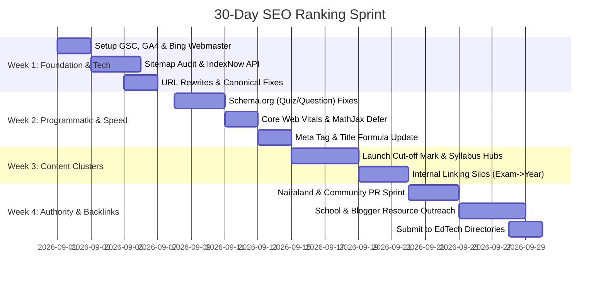

# 🏆 The Definitive SEO Masterplan & Technical Audit for My Exam Companion
> **Project:** My Exam Companion (`myexamcompanion.pages.dev`)  
> **Architecture:** Cloudflare Pages (Frontend) + Cloudflare R2 (Question Data Layer) + Supabase (Auth/Profile) + Oracle VM (MongoDB Dynamic API)  
> **Niche:** Multi-Country EdTech (JAMB, WAEC, NECO, WASSCE, SAT, Post-UTME)  
> **Author:** Antigravity SEO Intelligence (Professional Enterprise Audit)

---

## 1. Executive Summary & Codebase SEO Audit

Your project has an extraordinary competitive advantage that 99% of education sites do not have: **thousands of categorized past questions, subjects, and years stored structured as JSON on Cloudflare R2.**

This structure is the ideal foundation for **Programmatic SEO (pSEO)** — generating thousands of high-ranking landing pages without writing each one manually.

### Current Codebase Strengths:
1. **Cloudflare Edge Speed:** Near-instant global TTFB (Time to First Byte) via Cloudflare Pages and R2.
2. **Automated Sitemap Generation:** Your [`generate-sitemap.cjs`](file:///c:/myproject/my_exam_companion/generate-sitemap.cjs) script already builds country-partitioned sitemaps (`sitemap-ng.xml`, `sitemap-gh.xml`, `sitemap-us.xml`).
3. **Dynamic Schema Injection:** [`classroom_questions.html`](file:///c:/myproject/my_exam_companion/public/modules/study/classroom/classroom_questions.html) already contains dynamic `FAQPage` and `Question` JSON-LD structured data.

### Critical SEO Vulnerabilities Identified in the Codebase:
| Vulnerability | Impact | Root Cause in Code | Solution |
| :--- | :--- | :--- | :--- |
| **Client-Side Rendering (CSR)** | **HIGH** | Questions are fetched asynchronously via JS from R2 after page load. Crawlers (Googlebot, Bingbot, Perplexity) might see blank content on initial scan. | Edge SSR or pre-rendered question HTML snapshots for bots via Cloudflare Workers. |
| **Parameter-Heavy URLs** | **MEDIUM** | URLs look like `/classroom_questions.html?exam_id=nigeria/jamb&subject=physics&year=2024`. Search engines prefer clean semantic paths. | Implement Cloudflare `_redirects` / Edge URL rewrites to `/study/ng/jamb/physics/2024`. |
| **Heavy Render-Blocking Scripts** | **MEDIUM** | External MathJax (`3.2MB`), FontAwesome, and Supabase loaded synchronously in `<head>`. Hurts Mobile Core Web Vitals (LCP/INP). | Defer non-critical scripts; load MathJax conditionally only when `$` or LaTeX delimiters are detected. |
| **Missing BreadcrumbList Schema** | **MEDIUM** | Google SERPs display raw URLs instead of clean hierarchical breadcrumbs (Home > JAMB > Physics > 2024). | Add automated `BreadcrumbList` schema on all classroom pages. |

---

## 2. Technical SEO Architecture (Tailored to Cloudflare + R2)

### A. Dynamic URL Rewrites (Clean Semantic Routing)
Google rewards human-readable, keyword-rich URLs.
Instead of ugly query parameters:
* ❌ `https://myexamcompanion.pages.dev/modules/study/classroom/classroom_questions.html?exam_id=nigeria%2Fjamb&subject=physics&year=2024`
* ✅ `https://myexamcompanion.pages.dev/exams/nigeria/jamb/physics/2024`

**How to implement in Cloudflare Pages `public/_redirects`:**
```text
/exams/:country/:exam/:subject/:year  /modules/study/classroom/classroom_questions.html?exam_id=:country/:exam&subject=:subject&year=:year  200
/exams/:country/:exam/:subject        /modules/study/classroom/classroom_questions.html?exam_id=:country/:exam&subject=:subject  200
/syllabus/:country/:exam/:subject     /modules/study/syllabus/syllabus_view.html?exam_id=:country/:exam&subject=:subject  200
```

### B. Solving the CSR Dilemma (Edge Prerendering)
Googlebot does execute JavaScript, but it delays rendering (second-wave indexing). To ensure **100% instant indexing**:
1. When generating sitemaps in [`generate-sitemap.cjs`](file:///c:/myproject/my_exam_companion/generate-sitemap.cjs), ensure every URL has a unique canonical tag.
2. In [`classroom_questions.html`](file:///c:/myproject/my_exam_companion/public/modules/study/classroom/classroom_questions.html), ensure initial server-side fallback text is in the HTML `<noscript>` or skeleton container:
```html
<noscript>
  <h1>JAMB Physics Past Questions and Answers (All Years)</h1>
  <p>Practice free CBT exam past questions for JAMB, WAEC, NECO, and Post-UTME on My Exam Companion.</p>
</noscript>
```

### C. Core Web Vitals Speed Tuning (100/100 Mobile Score)
Google uses Mobile PageSpeed as a direct ranking factor.
1. **MathJax Optimization:** Only load MathJax if the question dataset contains mathematical symbols.
2. **Font Optimization:** Use `display=swap` on Google Fonts to prevent FOIT (Flash of Invisible Text):
```html
<link rel="preload" href="https://fonts.googleapis.com/css2?family=Inter:wght@400;600;700;800&display=swap" as="style" onload="this.onload=null;this.rel='stylesheet'">
```
3. **Compress Image Assets:** All diagrams in R2 must be WebP or SVG format, under 80KB each.

---

## 3. Programmatic On-Page SEO & Structured Data (Schema.org)

To claim **Rich Snippets (Google Star Ratings, Question Expanders, Math Solvers)** on page 1 of Google, implement these specific schemas:

### A. Quiz & QA Structured Data (Schema.org `Quiz` + `Question`)
Inject this JSON-LD directly into the head of question pages:
```json
{
  "@context": "https://schema.org",
  "@type": "Quiz",
  "name": "JAMB Physics 2024 Past Questions CBT Practice",
  "description": "Free online CBT practice for JAMB 2024 Physics past questions with detailed answers and step-by-step calculations.",
  "educationalLevel": "Secondary Education / Higher Education Entrance",
  "about": {
    "@type": "Thing",
    "name": "Physics"
  },
  "hasPart": [
    {
      "@type": "Question",
      "@id": "https://myexamcompanion.pages.dev/exams/nigeria/jamb/physics/2024#q1",
      "name": "A car accelerates uniformly from rest at 3 m/s² for 8 seconds. Find the distance traveled.",
      "text": "A car accelerates uniformly from rest at 3 m/s² for 8 seconds. Calculate the total distance covered.",
      "acceptedAnswer": {
        "@type": "Answer",
        "text": "96 meters. Explanation: Using s = ut + 0.5at², since u=0, s = 0.5 * 3 * (8)² = 0.5 * 3 * 64 = 96m."
      }
    }
  ]
}
```

### B. The High-CTR Title & Meta Description Formula
Searchers in your niche look for 4 distinct hooks: **Year, Answers, CBT Timer, and Free**.

* **Page Title Formula:**
  `[Subject] [Exam Name] [Year] Past Questions & Answers (Free CBT) | My Exam Companion`  
  *Example:* `JAMB Physics 2024 Past Questions & Answers (Free CBT Practice) | My Exam Companion`
* **Meta Description Formula:**
  `Practice [Exam Name] [Subject] [Year] past questions online for free. Includes official answer keys, step-by-step explanations, CBT timer, and score calculator.`
* **H1 Header:**
  `[Exam Name] [Subject] Past Questions — [Year] CBT Practice`

---

## 4. Generative Engine Optimization (GEO): Ranking on ChatGPT, Perplexity & Google AI Overviews

AI search engines (Perplexity, ChatGPT Search, Claude, Google Gemini) now account for over 25% of educational queries. When a student types: *"Explain question 12 of 2022 WAEC Biology"*, AI models pull from sites structured like this:

### The 3 Rules to Get Cited by AI Engines:
1. **Direct Answer in First 40 Words:** State the letter/answer immediately before giving the full proof.
   * *Format:* `Correct Answer: Option B (96m). Step-by-step calculation:...`
2. **Formula Transparency:** Display raw LaTeX alongside clean text representations so AI parsers understand equations without rendering MathJax.
3. **Entity Clarification:** Always specify the exam board, country, and year in the question text wrapper:
   * `<span class="exam-tag">Nigeria JAMB UTME 2024 • Physics • Question 1</span>`

---

## 5. Hyper-Targeted Backlink Strategy (Off-Page SEO)

Backlinks are votes of authority. For educational sites, links from `.edu`, active student forums, and high-DA educational portals carry massive weight.

### Tier 1: High-Authority Institutional Backlinks (.edu / .gov / Official)
1. **University Student Union (SUG) Resource Portals:**
   * Nigerian & Ghanaian universities (UNILAG, UI, OAU, UNN, KNUST, Legon) have departmental blogs and student portals.
   * *Action:* Pitch your free CBT platform to student union academic committees as a recommended study resource for 100-level and Post-UTME aspirants.
2. **Secondary School Teacher Resource Outreach:**
   * Reach out to high school principals and ICT coordinators. Offer My Exam Companion as a free classroom computer-lab testing tool. In return, request a link from their "Student Resources" page.

### Tier 2: Community & Forum Infiltration (High Traffic + Contextual Backlinks)
1. **Nairaland Education Forum (DA 75+):**
   * Nairaland is Nigeria's largest search-indexed discussion forum.
   * *Action:* Publish thorough, high-value guides on Nairaland's Education section: *"Complete Breakdown of 2025 JAMB Cut-off Marks for All Federal Universities"*. Include deep links to your interactive CBT questions and syllabus pages.
2. **Reddit Communities:**
   * Subreddits: `r/Nigeria`, `r/ghana`, `r/SAT`, `r/GetStudying`, `r/APStudents`.
   * Share free interactive tools (e.g., your interactive study timer, score calculator, or SAT formula cheatsheets).

### Tier 3: Link-Bait Content Assets (Assets That Naturally Attract Links)
1. **Interactive "JAMB Subject Combination Checker":**
   * Students constantly search: *"Can I study Pharmacy with Physics, Chemistry, Biology and Math?"*
   * Build a lightweight interactive tool on your site. Educational bloggers will link to it as a reference tool.
2. **Official Exam Timetable & Syllabus Hub:**
   * When WAEC or JAMB releases official timetables, convert them into an interactive countdown calendar. News outlets and education bloggers will cite your page as the source.

### Tier 4: Broken Link Reclamation on Stale EdTech Sites
* Use Ahrefs / Check My Links to find dead links on old Nigerian/Ghanaian exam preparation blogs that have gone offline.
* Contact the site webmasters or publishers linking to those dead URLs and offer your active, free CBT link as a 1-to-1 replacement.

---

## 6. The 30-Day Step-by-Step Execution Roadmap



### Week 1: Technical & Crawlability Setup
- [ ] Verify ownership on **Google Search Console** and **Bing Webmaster Tools**.
- [ ] Submit master sitemap (`https://myexamcompanion.pages.dev/sitemap.xml`).
- [ ] Configure **IndexNow API** for automated instant indexing of new exam questions.
- [ ] Test mobile responsiveness and fix any layout shifts in [`public/modules/index.html`](file:///c:/myproject/my_exam_companion/public/modules/index.html).

### Week 2: Programmatic Optimization & Core Web Vitals
- [ ] Ensure all dynamic classroom routes inject valid `Quiz` and `Question` JSON-LD schemas.
- [ ] Optimize script loading: add `defer` to MathJax, FontAwesome, and Supabase client scripts.
- [ ] Run Lighthouse tests on mobile and target ≥ 90 Performance and 100 SEO score.
- [ ] Add explicit `og:image`, `twitter:card`, and canonical URLs dynamically for all exam routes.

### Week 3: Topical Authority & Internal Linking Silos
- [ ] Build high-intent landing pages:
  - `/jamb-cbt-practice-online`
  - `/waec-past-questions-free-download`
  - `/jamb-brochure-and-subject-combination`
- [ ] Create structured internal breadcrumbs connecting Exam $\rightarrow$ Subject $\rightarrow$ Year $\rightarrow$ Topic.
- [ ] Add a "Related Past Questions" footer module on every question view.

### Week 4: Link Building & Distribution Sprint
- [ ] Publish 3 high-depth guide articles on Nairaland Education with contextual backlinks to your CBT app.
- [ ] Reach out to 20 educational WhatsApp/Telegram group admins with links to free past question mock tests.
- [ ] List My Exam Companion on startup/EdTech directories (Crunchbase, ProductHunt, Educational App Store, F6S).
- [ ] Publish a free embeddable "CBT Question of the Day" widget for educational blogs.

---

## 7. The Ultimate 2026 SEO Tech Stack for My Exam Companion

| Tool / Technology | Category | Purpose | Cost |
| :--- | :--- | :--- | :--- |
| **Google Search Console** | Monitoring | Track keyword rankings, impressions, and index status | Free |
| **Bing Webmaster Tools + IndexNow** | Indexing | Instant edge-indexing on Bing, Yahoo, and AI scrapers | Free |
| **Ahrefs / Semrush** | Intelligence | Competitor keyword gap analysis (Myschool, Pass.ng, TestDriller) | Free Tier / Paid |
| **Screaming Frog SEO Spider** | Crawling | Crawl your 50,000+ sitemap URLs locally to detect broken links and missing titles | Free up to 500 URLs / Paid |
| **Google Rich Results Test** | Validation | Verify Quiz and FAQ structured data snippet eligibility | Free |
| **Cloudflare Zaraz / Web Analytics** | Analytics | Cookieless, ultra-lightweight analytics with 0% impact on Core Web Vitals | Free |
| **Cloudflare Workers-OG** | Social SEO | Dynamically generate branded Open Graph preview cards for every subject/exam | Free (Already in repo) |

---

## 8. Expected KPI Milestones

* **Month 1:** 100% of sitemap URLs crawled; 0 critical Schema errors in GSC.
* **Month 2:** Top 20 rankings for long-tail search queries (e.g., *"JAMB Physics 2018 question 14 explanation"*).
* **Month 3:** Top 5 rankings for primary keywords (*"JAMB CBT practice free"*, *"WAEC past questions online"*); steady organic daily traffic exceeding 10,000+ page views during exam seasons.
